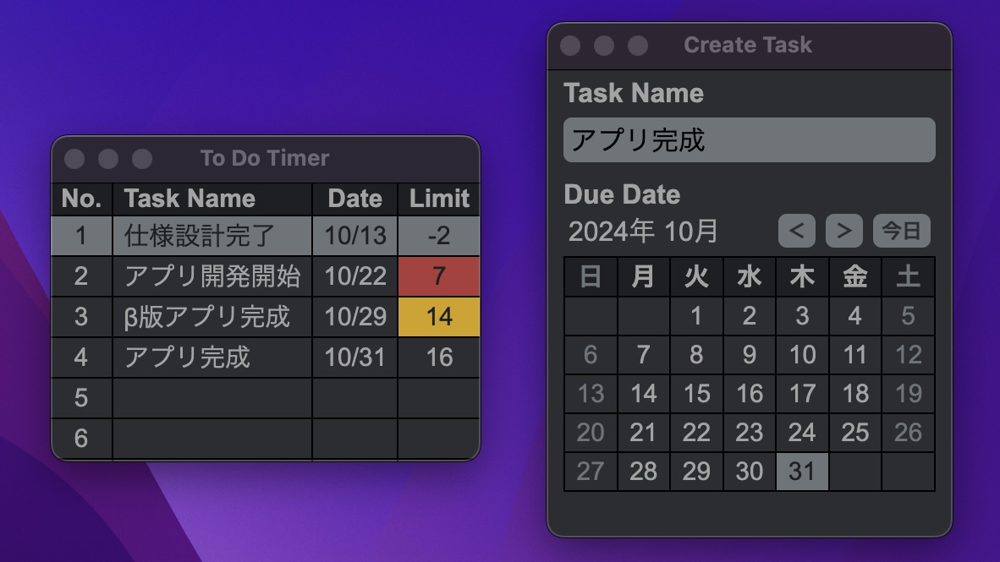
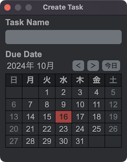
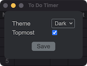

# To Do Timer

### タスクの締め切りまでの日数を表示するアプリ（Mac・Windows 対応）

## 特徴

### 1. タスクの締め切り日数を表示

黄色：締め切り2週間以内、赤：締め切り1週間以内、グレー：締め切り以降

### 2. タスクの表示順を締め切り順で自動ソート

### 3. シンプルな操作性

### 4. ミニマムなウィンドウサイズ

## インストール方法

Mac

1. **[ここから](https://liba-b.work/electron%e3%82%92%e4%bd%bf%e3%81%a3%e3%81%9f%e3%82%bf%e3%82%b9%e3%82%af%e3%82%bf%e3%82%a4%e3%83%9e%e3%83%bc%e3%82%a2%e3%83%97%e3%83%aa%e3%81%ae%e9%96%8b%e7%99%ba/)** インストーラー（dmgファイル）をダウンロード  
ダブルクリックでインストーラーを起動し、アイコンをドラッグしてアプリを追加  
1. ターミナルを起動し、次のコマンドを実行

    `xattr -rc /Applications/To\ Do\ Timer.app; echo $?`  

    `0`が出力されればインストール完了

> [!CAUTION]
> 本アプリはAppleの審査を受けていません。

Windows

## アンインストール方法

Mac

Windows

## 使用方法

* 新規タスク作成  
  Task Nameが空の行をダブルクリックするとタスク作成画面が表示されます。

  

  タスク名を入力。ダブルクリックで締め切り日を設定します。  
  タスク作成画面を閉じるとタスクが新規登録されます。  
  `Cmd Enter` または `Ctrl Enter`で画面を閉じることもできます。

  タスクは最大`20個`まで登録することができます。
* タスク編集  
  編集したいタスクをダブルクリックするとタスク作成画面が表示されます。  
  タスク名と、締め切り日を編集しタスク作成画面を閉じるとタスクの内容が更新されます。
* タスク削除  
  削除したいタスクをダブルクリックするとタスク作成画面が表示されます。  
  タスク名を空にしてからタスク作成画面を閉じるとタスクが削除されます。
* 画面フロート設定  
  タスクが表示されている画面上で右クリックし、`Settings` をクリックすると設定画面が表示されます。

    

  * テーマ（Dark / Light）の選択ができます。
  * Topmostにチェックを入れると画面がフロートします。

---

## 開発

1. $ git clone <https://github.com/LibertyReman/electron-to-do-timer.git>
1. $ cd electron-to-do-timer/
1. $ npm install
1. $ npm run start

## 設計

アクティビティ図

## ライセンス

* License: GNU General Public License v3.0
* License URI: <http://www.gnu.org/licenses/gpl-3.0.html>
* Author: Liba
