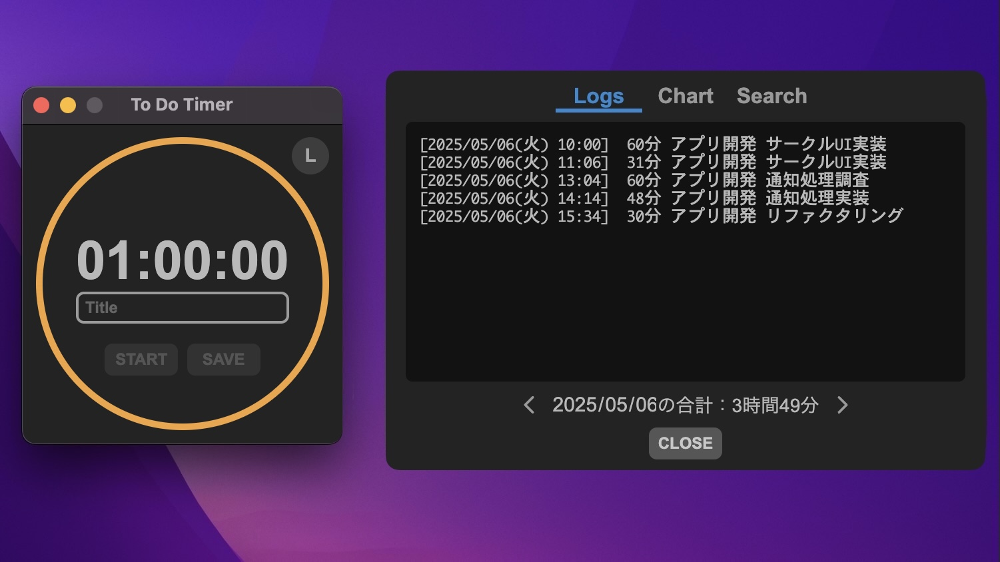
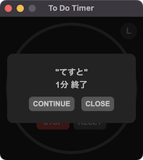

# To Do Timer

## ログ機能付きタイマーアプリ（Mac・Windows 対応）

## 特徴

### ・ ｘ時間毎に「①いつ、②どんなタスクを、③どれだけの時間行っていたか」ログを取ることで作業工数の実績を計測

### ・ ミニマルデザイン・使いやすいUI

### ・ 2種類のアラーム音と音量調整が可能

## インストール方法

> [!WARNING]
> 本アプリを使用する場合は自己責任で使用してください。

Mac

1. **[ここから](https://liba-b.work/electron%e3%82%92%e4%bd%bf%e3%81%a3%e3%81%9f%e3%83%ad%e3%82%b0%e6%a9%9f%e8%83%bd%e4%bb%98%e3%81%8d%e3%82%bf%e3%82%a4%e3%83%9e%e3%83%bc%e3%82%a2%e3%83%97%e3%83%aa%e3%81%ae%e9%96%8b%e7%99%ba/)** インストーラー（dmgファイル）をダウンロード  
ダブルクリックでインストーラーを起動し、アイコンをドラッグしてアプリを追加
1. ターミナルを起動し、次のコマンドを実行

    `xattr -rc /Applications/To\ Do\ Timer.app; echo $?`

    `0`が出力されればインストール完了

Windows

* **[ここから](https://liba-b.work/electron%e3%82%92%e4%bd%bf%e3%81%a3%e3%81%9f%e3%83%ad%e3%82%b0%e6%a9%9f%e8%83%bd%e4%bb%98%e3%81%8d%e3%82%bf%e3%82%a4%e3%83%9e%e3%83%bc%e3%82%a2%e3%83%97%e3%83%aa%e3%81%ae%e9%96%8b%e7%99%ba/)** インストーラー（exeファイル）をダウンロード  
ダブルクリックでインストーラーを起動しアプリをインストールする  
※ システムにアプリをインストールせずに使用したい場合は、ポータブル版を使用してください。

## アンインストール方法

Mac

* アプリケーションフォルダから`To Do Timer.app`を削除する

Windows

* `プログラムの追加と削除`から`To Do Timer`を削除する

## 使用方法

* タイマー  
  1. 時間をクリックしタイマー時間を設定します。
  1. タイトルを入力します。  
  入力中に`Enter` を押すとフォーカスが外れます。
  1. STARTボタン押下でタイマーがスタートします。  
  STOPボタン押下でタイマーがストップします。  
  RESETボタン押下でタイマーがリセットします。  

* ログ保存  
  タイムアウトするとログが保存されます。  

  

  `CONTINUEボタン`を押下するとログ保存後にタイマーが再スタートします。  
  タイムアウト前にログを保存したい場合は`STOPボタン`を押下してから`SAVEボタン`を押下します。  

* ログ確認  
  アプリ画面右上の`Lボタン`を押下するとログが表示されます。  

  

  ログは`'タイマー開始時間 タイマー時間 タイトル'`の形式で記録されます。  
  本日の合計時間が表示されます。  

* アプリ設定  
  アプリの画面上で右クリックし、`Settings` をクリックすると設定画面が表示されます。  

  

  * 2種類のアラーム音の選択ができます。
  * アラーム音の音量を調整できます。
  * `本日の合計`のリセット時間を変更できます。  
    例：9 に設定した場合、朝の9時にリセットします。
  * Topmostにチェックを入れると画面がフロートします。

---

## 開発

1. $ git clone <https://github.com/LibertyReman/electron-to-do-timer.git>
1. $ cd electron-to-do-timer/
1. $ npm install
1. $ npm run start

## 使用ライブラリ・コンテンツ

* 時間選択：flatpickr - https://github.com/flatpickr/flatpickr
* 効果音：ポケットサウンド – https://pocket-se.info/

## ライセンス

* License: GNU General Public License v3.0
* License URI: <http://www.gnu.org/licenses/gpl-3.0.html>
* Author: KK

